# Face Mask Detector System
The main aim of this system is to detect whether an individual is wearing a face mask or not and process the result for either opening or not opening the door.

In order to integrate the hardwares for the system at first all of the required hardwares should be collected. All of the hardwares required for this system are as;
1.	Raspberry Pi 4 Model B (4 GB RAM)-with fan and casing and Power supply
2.	PiCamera
3.	32 GB Memory Card
4.	USB Keyboard
5.	USB Mouse
6.	Monitor
7.	2 LEDs (Orange and Green)
8.	Servo Motor 

The circuit diagram of the system is presented as;
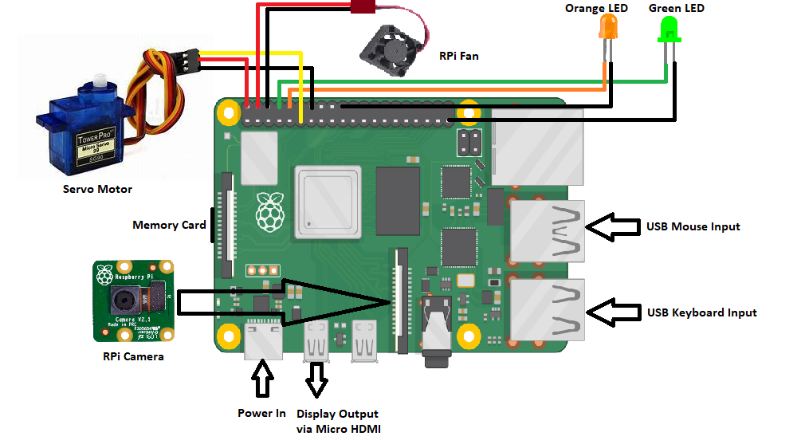

As presented in the circuit diagram, the PiCamera and the Memory Card were inserted to the camera slot and the Memory Card slot of the RaspberryPi respectively, USB Keyboard and USB Mouse were connected to two of the USB ports. Similarly, Power Supply was given via the USB Type-C port and the Display Output was presented in the Monitor via the Micro HDMI port. Moreover, the remaining actuators were connected to the designated GPIO pins like;
1.	Servo Motor 
    VCC Pin to Pin 2  
    Signal Pin to GPIO 17  
    Ground Pin to Pin 14 
2.	RPI Fan 
    VCC Pin to Pin 4 
    Ground Pin to Pin 6 
3.	Orange LED 
    Anode to GPIO 15  
    Cathode to Pin 20 
4.	Green LED 
    Anode to GPIO 14 
    Cathode to Pin 39 

In order to work with the system at first the python programming language should be installed in the opersting system. And then the libraries like;
1. Open CV
2. imutils
3. TensorFlow
4. Matplotlib
5. Sklearn  

should be installed.Then the system can easily be run in the OS. After the completion of the integration of the hardware and software now its time to work with the system.  
In order to detect the mask at first the directory of the system should be set by typing 
"cd face_mask_detection" 
in the command prompt and then  
"python3 detect_mask.py" 
Similarly, in order to detect the mask and open the door  
"python3 detect_mask_and_open_door.py" should be run in the command prompt.

During the model training, the loss and accuray was plotted in the line graph using Matplotlib and Sklearn and the graph was developed as; 
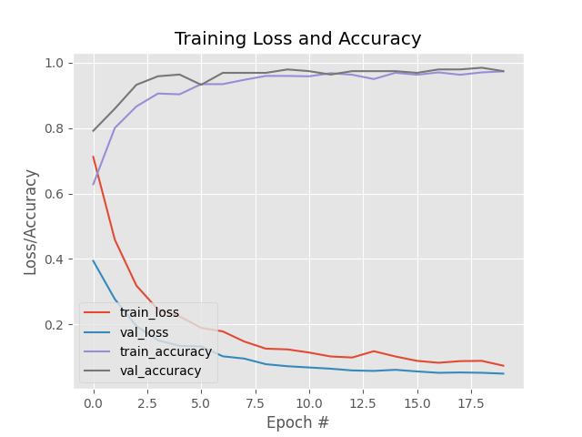 
while using 2000 images for training and 
Similarly,  
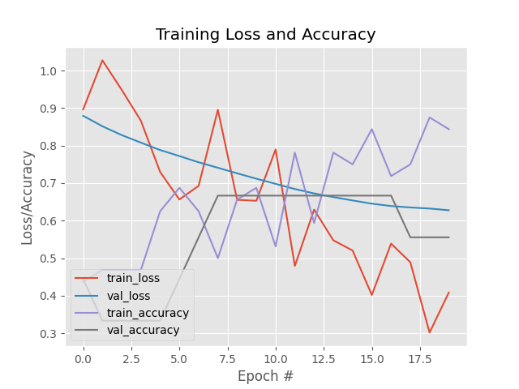  when trained with 40 images.

Demonstration of the system working is shown as; 
1. For detecting the mask 
Mask is detected
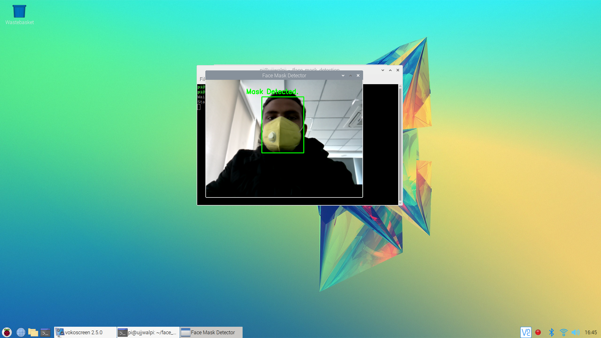
Green LED is blinked
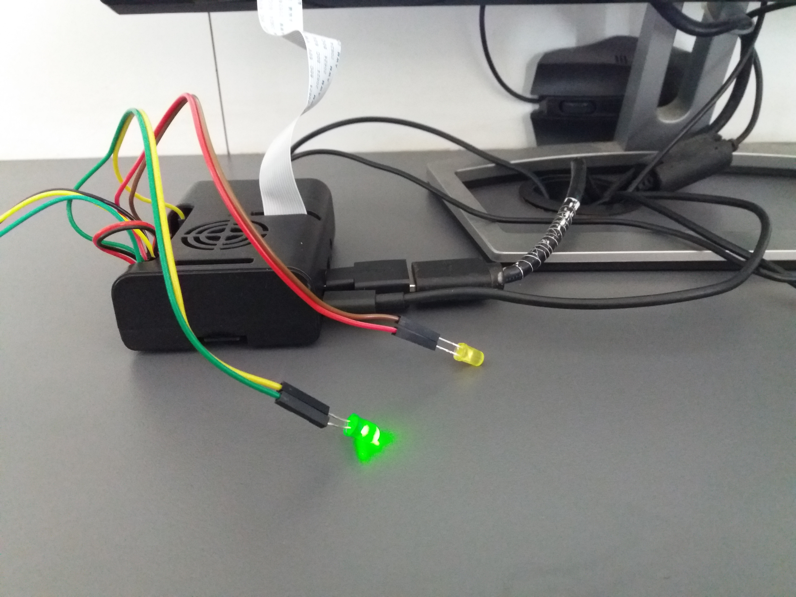
Mask is not detected
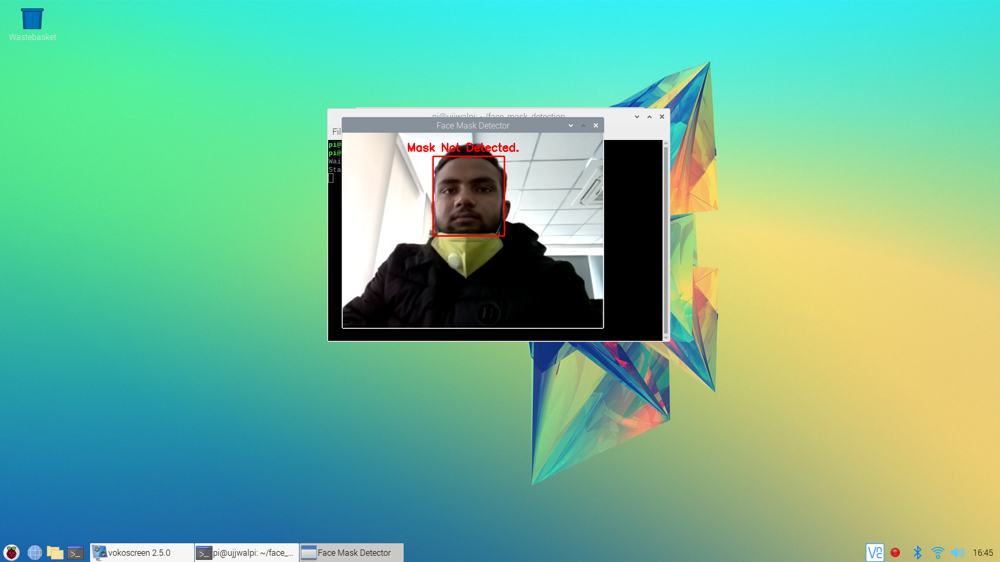
Orange LED is blinked
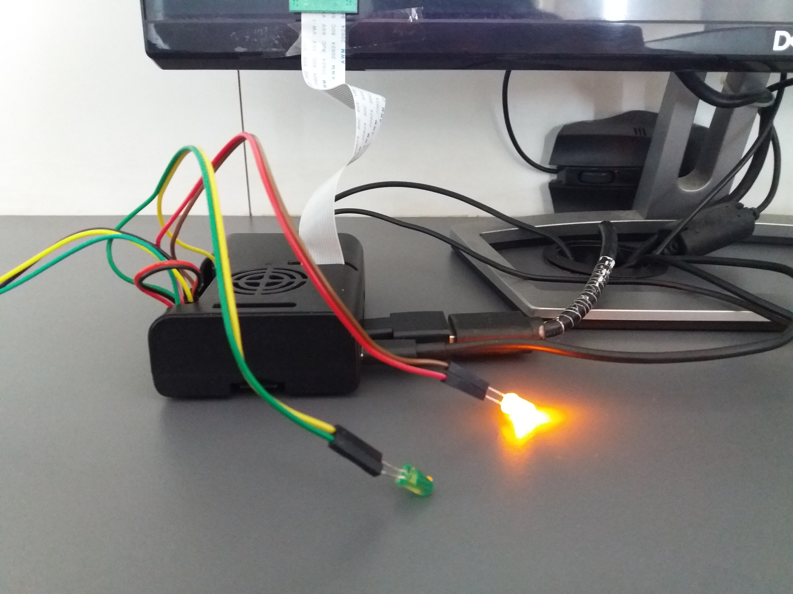  

2. For detecting the mask and opening the door
Mask is not detected
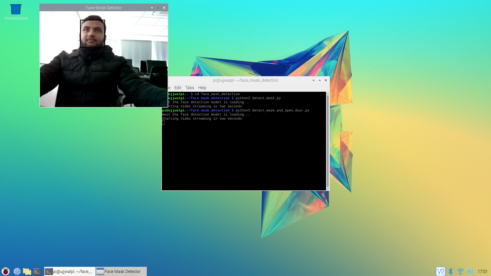
Orange LED is blinked
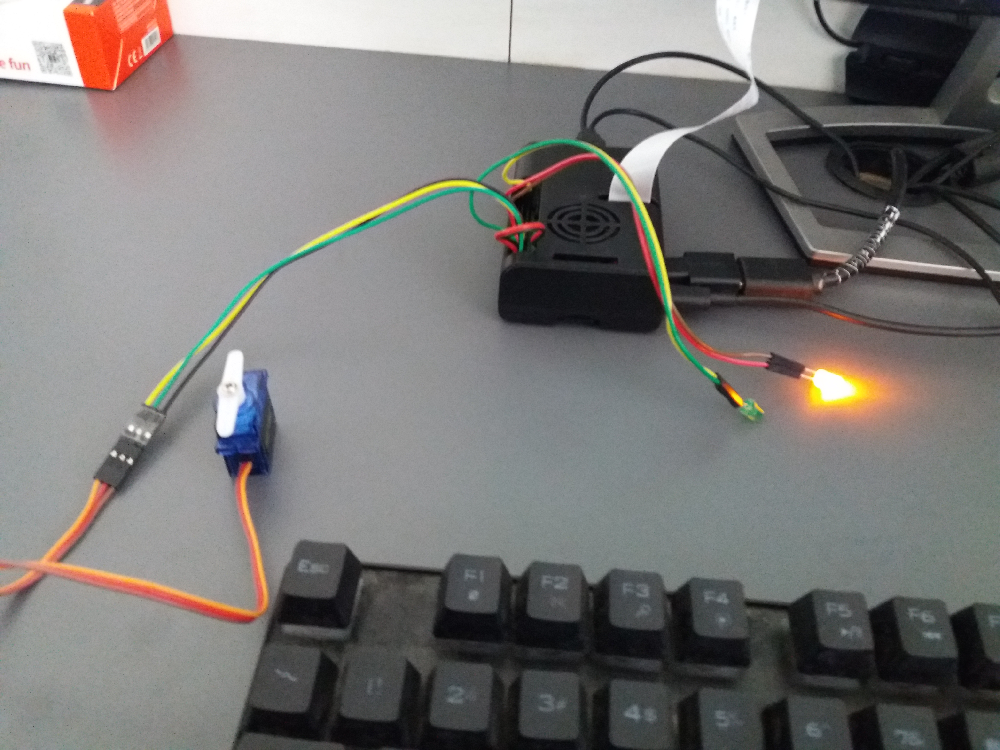 
Mask is detected
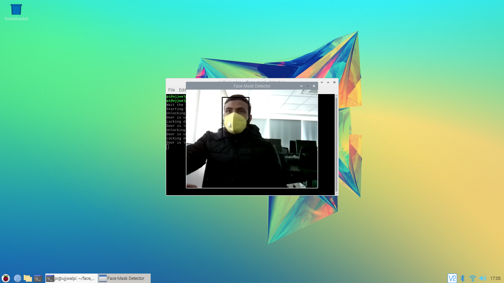
Green LED is blinked and servo motor is rotated to 180°
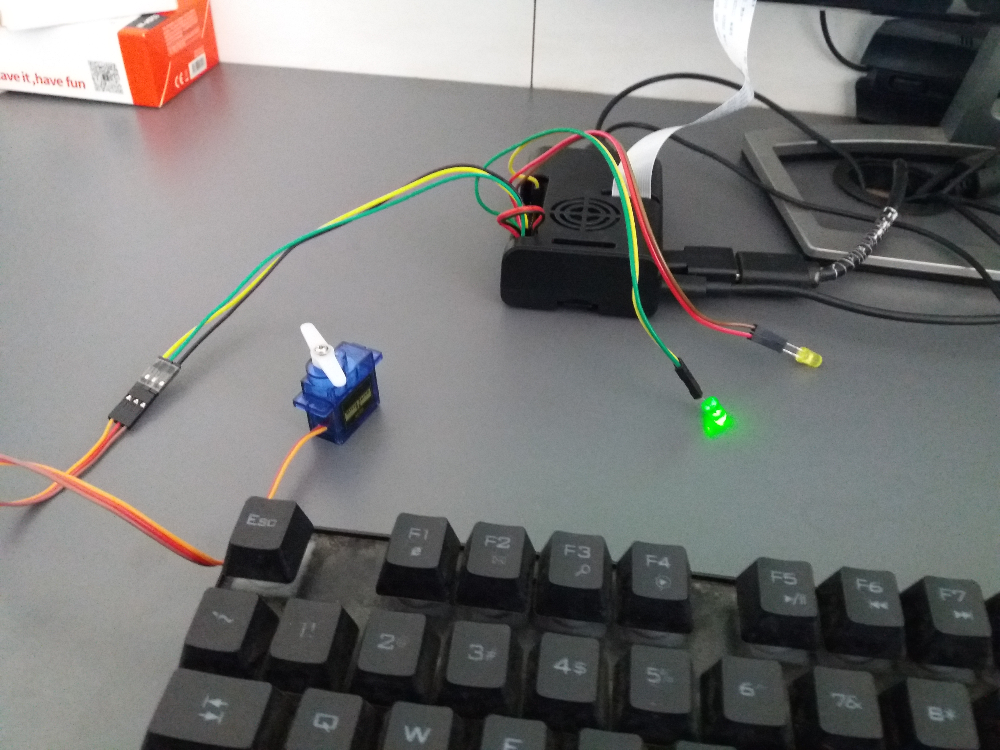
After the duration of 5 seconds the door is closed
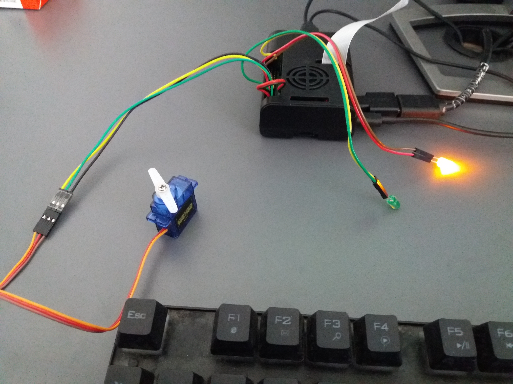

 

The video showing the demostatration of the system is at
https://youtu.be/h8cR8jIbGL8 .
